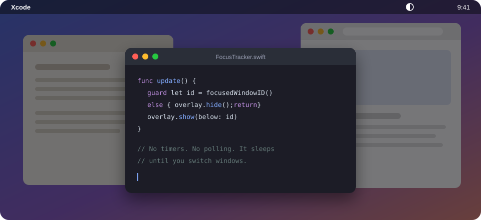

<div align="center">



# Dimmer

**A free, open-source HazeOver alternative for macOS.**
It fades out everything behind the window you're working in.

[](https://github.com/mathiasthu/dimmer/releases/latest)


[](LICENSE)

</div>

---

## Why another dimmer?

HazeOver works well, but on my Mac it averaged about 10% of a CPU core all day just to keep a dark sheet behind one window. Dimmer does the same job without that cost.

|                               | HazeOver     | Dimmer         |
| ----------------------------- | ------------ | -------------- |
| CPU when you're not switching | ~10% average | **0.0%**       |
| Idle wakeups                  | ~550         | **0**          |
| Memory                        | ~80 MB       | **16 to 24 MB**  |
| Download                      | paid / Setapp| **66 KB, free**|

<sub>Measured with <code>top</code> and <code>ps</code> on one Apple Silicon Mac running macOS 27, October 2026. Your numbers will vary.</sub>

It runs on events instead of a loop. Dimmer sleeps until macOS tells it that focus moved or a window was dragged, then reorders one window and goes back to sleep. Nothing is redrawn on a timer, and the dim layer is a plain black window that the GPU composites for free.

## Features

- Dims everything behind the focused window on every display, with a 0.15 s fade.
- Follows focus across apps, Spaces and windows of the same app.
- Choose which displays get dimmed, or dim only the display that holds the focused window, so a second screen can stay bright.
- Intensity slider in the menu bar, from 10% to 80%, applied live.
- Fades out when no window has focus, so an empty desktop never goes dark.
- Launch at login toggle, off by default.
- It has no Dock icon and doesn't collect analytics or touch the network. The whole app is about 380 lines of Swift.

## Install

1. Download **`Dimmer.zip`** from the [latest release](https://github.com/mathiasthu/dimmer/releases/latest) and unzip it.
2. Drag **Dimmer.app** into **Applications**.
3. Open it. Dimmer isn't notarized by Apple, so macOS blocks the first launch:
   - Open **System Settings › Privacy & Security**, scroll down and click **Open Anyway** next to Dimmer.
   - Or run this once in Terminal:
     ```sh
     xattr -dr com.apple.quarantine /Applications/Dimmer.app
     ```
4. Grant **Accessibility** access when asked (System Settings › Privacy & Security › Accessibility). Dimmer uses it only to find out which window has focus.

Look for the half-filled circle ◐ in your menu bar.

> If you used HazeOver before, quit it first. Two dimmers stack and your screen will look twice as dark.

## Build from source

You'll need Xcode or the Command Line Tools (Swift 5.10 or newer).

```sh
git clone https://github.com/mathiasthu/dimmer.git
cd dimmer
scripts/build-app.sh   # universal build, ad-hoc signed, writes dist/Dimmer.app and dist/Dimmer.zip
scripts/install.sh     # copies it to ~/Applications
```

Builds are ad-hoc signed, so macOS may ask you to grant Accessibility again after you rebuild.

## How it works

```
NSWorkspace: app activated ─┐
AXObserver: focus / move /  ├─► coalesce (one update per run-loop turn)
  resize / minimize        ─┘        │
                                     ▼
              focused AXUIElement ──► CGWindowID
                                     │
                                     ▼
       overlay.order(.below, relativeTo: windowID)   ← one black window per screen
```

There's one borderless, click-through window per screen at normal window level, and Dimmer keeps it directly below the focused window in the system's window order. Everything under that window gets dimmed and the focused window stays on top. The Accessibility API reports focus changes, and a private but long-stable call (`_AXUIElementGetWindow`) maps the focused window to its window number. If that call ever fails, Dimmer matches by process and window bounds instead.

## Known limits

- **Stage Manager** and **full-screen Spaces** aren't handled specially yet.
- Apps with poor Accessibility support (some Java and Electron apps) don't report a focused window, so Dimmer stays off while they're in front.
- Not on the Mac App Store. The sandbox doesn't allow reordering other apps' windows this way.

## Roadmap

- Per-app rules (never dim behind Zoom, keep a whole app bright)
- Global hotkey to toggle
- Schedules and Focus-mode triggers

Issues and pull requests are welcome.

## License

[MIT](LICENSE). Free to use, change and share.

---

<div align="center">
<sub>
Dimmer is free, and its development is supported by <a href="https://luxvps.net"><b>Luxvps</b></a> VPS hosting.<br>
Not affiliated with HazeOver or its developer. HazeOver is a trademark of its owner.
</sub>
</div>
